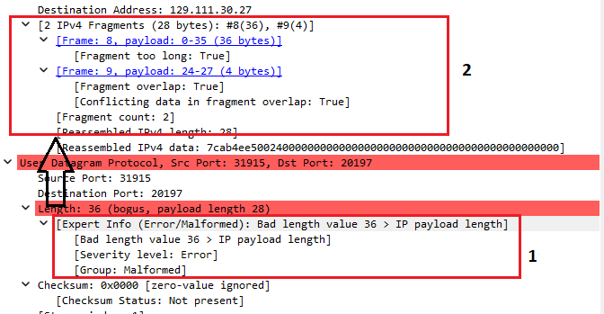

# Investigating a network trace for hacking
## In this lab you will analyze the network packet trace and discover how the hacker inflitrated the network.

After the recent hacking incident, the CTO need to know how the hackers infiltraded network and stole the 
codebase of the CRM program. You have been given a network trace from the hacked server and its your job to analyse 
the trace and discover how the hackers exploited the server. 

1. click on the Windows start and open Wireshark
2. Click on File on the top menu and then click Open
3. At the top of the Open Capture file dialog, click the down arrow in the Look in box
4. Navigate to the tmp folder and open teardrop.cap 
5. Analyse the traffic patterns in the catpure trace and notice that the packets start to fragment at line 8 
6. Move your mouse to line 8 and click once to bring up the data in the packet in the lower data windows windows.

7. Observe that the packet is IPv4 and is fragmented. This is not normal and deserve more investigation
8. Click in line 9, the rest of the fragmented packet. 
9.  Looking at the bottom left window, you can see Wireshark has already marked a couple of issues indicated by the red highlight. Kets investigate further 
10.  
11. 
